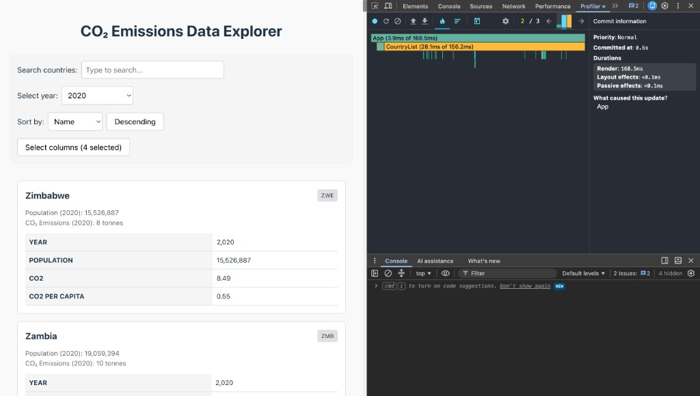
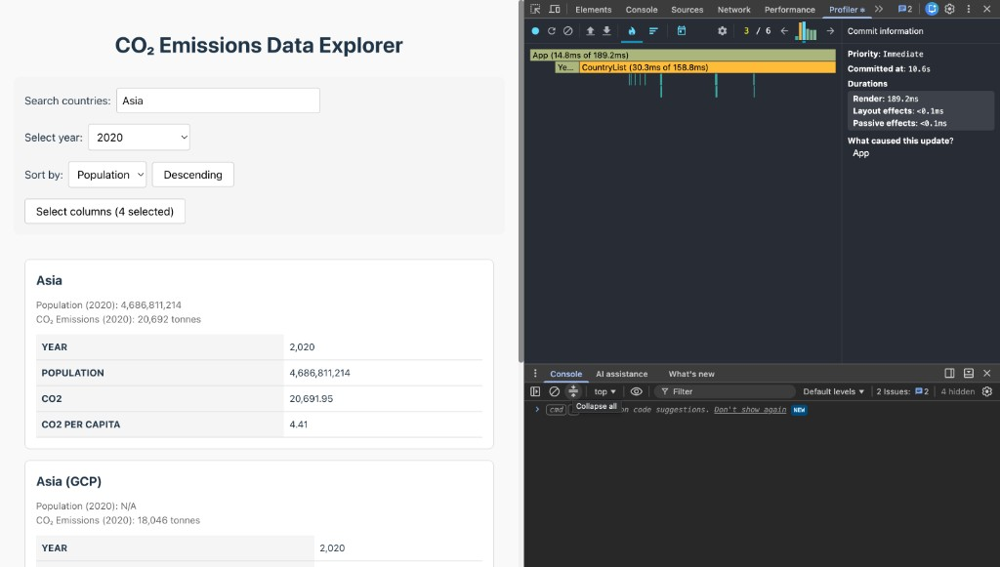
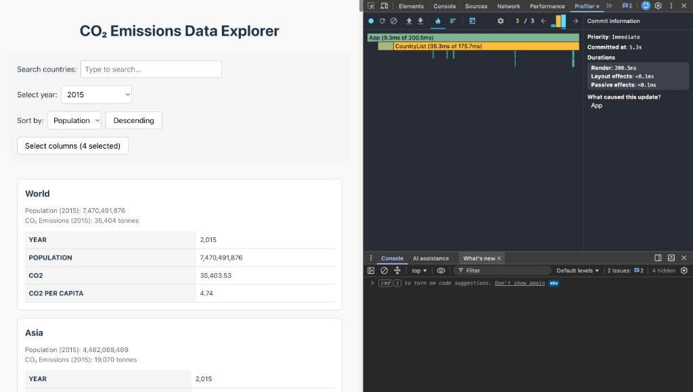
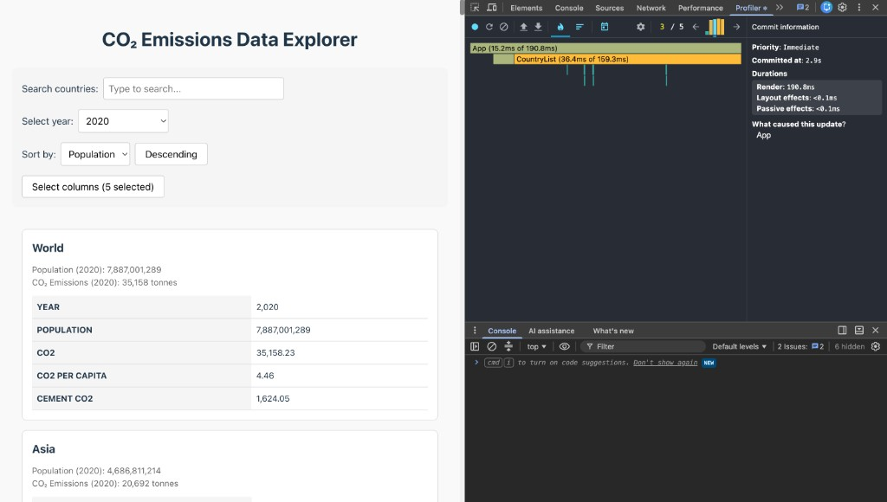
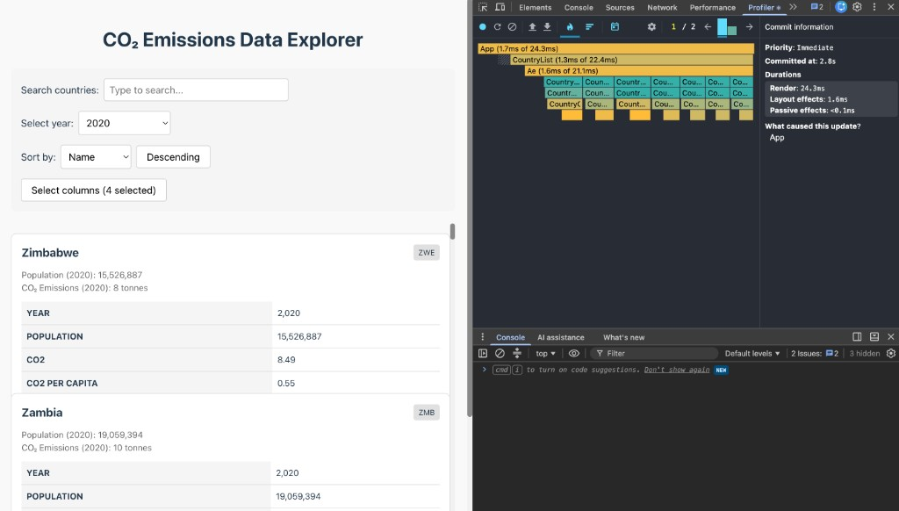
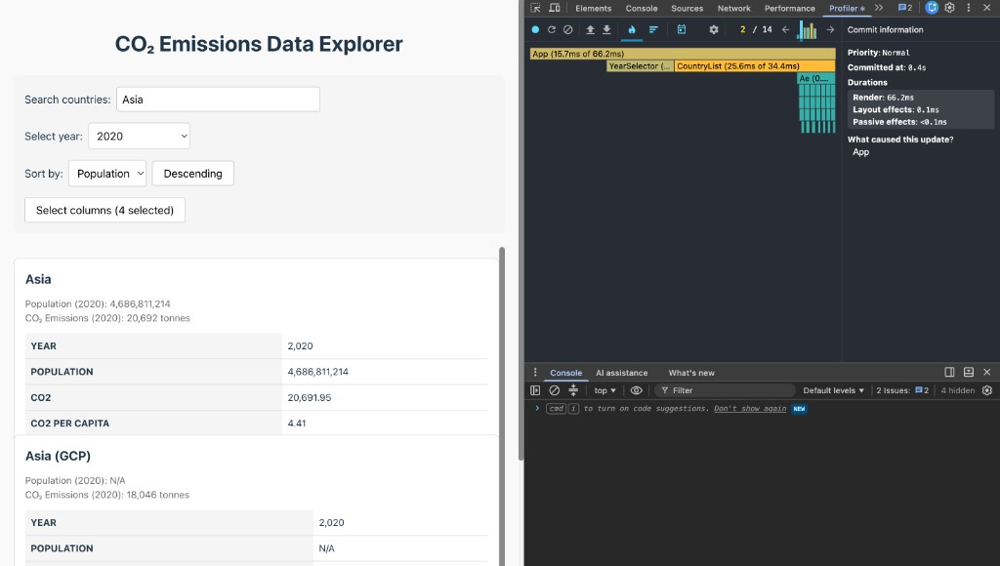
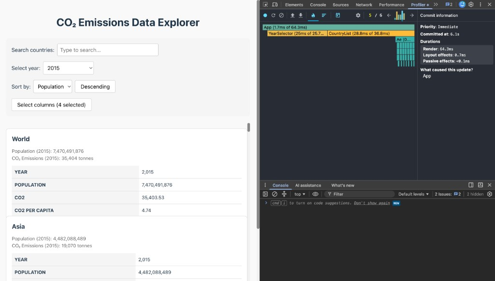
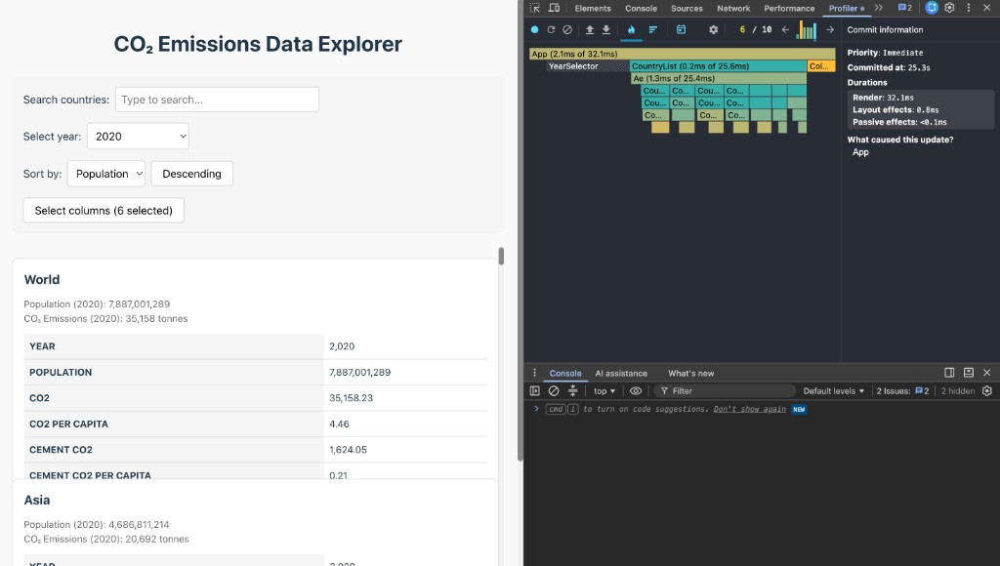

# Performance Report

## Environment

- App: CO₂ Emissions Data Explorer
- Mode: development (`npm run dev`)
- Profiler: React DevTools → Profiler
- Browser: Chrome
- Date: 2026-06-15

## Phase 1: Baseline (unoptimized starter)

App: `.performance-starter` → `npm run dev`

| Interaction | What to do | Which commit to screenshot |
| --- | --- | --- |
| Sorting | Sort by → `Name`, click `Descending` | Last commit: `App` → `CountryList` → many `CountryCard` |
| Search | Type `asia` in search | Last commit after typing: `App` → `CountryList` |
| Year change | Year → `2015` | Last commit: `YearSelector` + `CountryList` |
| Column toggle | `Select columns` → toggle checkbox → `Close` | Last commit: `CountryList` re-render |

### Baseline metrics

| Interaction | Commit duration (ms) | Render duration (ms) |
| --- | ---: | ---: |
| Sorting | 168.5 | 168.5 |
| Search | 189.2 | 189.2 |
| Year change | 200.5 | 200.5 |
| Column toggle | 190.8 | 190.8 |

### Baseline screenshots

**Sorting** (168.5 ms)



**Search** — filter `asia` (189.2 ms)



**Year change** — year `2015` (200.5 ms)



**Column toggle** (190.8 ms)



### Baseline notes

- Country list rendered all cards at once (no virtualization)
- List items used array `index` as React key
- Filter/sort ran on every parent render
- Child components re-rendered when unrelated app state changed
- Flame chart shows many `CountryCard` bars, render duration **168–200 ms**

## Phase 2: Optimizations applied

| Technique | Where |
| --- | --- |
| `useMemo` | `App` years, `CountryList` filtered countries + row props, `CountryCard` year map and metrics, `DataTable` selected year record |
| `useCallback` | `App` handlers (search, year, sort, columns, modal) |
| `React.memo` | `SearchBar`, `YearSelector`, `CountryList`, `CountryCard`, `DataTable`, `ColumnModal` |
| Stable list keys | `country.id` in virtualized list, column name in table rows, year in year selector |
| Virtualization | `react-window` `List` in `CountryList` |

## Phase 3: Optimized profiling

App: project root, branch `performance` → `npm run dev`

### Optimized metrics

| Interaction | Commit duration (ms) | Render duration (ms) |
| --- | ---: | ---: |
| Sorting | 24.3 | 24.3 |
| Search | 66.2 | 66.2 |
| Year change | 64.3 | 64.3 |
| Column toggle | 32.1 | 32.1 |

### Optimized screenshots

**Sorting** (24.3 ms)



**Search** — filter `asia` (66.2 ms)



**Year change** — year `2015` (64.3 ms)



**Column toggle** (32.1 ms)



### Comparison

| Interaction | Baseline render (ms) | Optimized render (ms) | Improvement |
| --- | ---: | ---: | ---: |
| Sorting | 168.5 | 24.3 | **85.6%** |
| Search | 189.2 | 66.2 | **65.0%** |
| Year change | 200.5 | 64.3 | **67.9%** |
| Column toggle | 190.8 | 32.1 | **83.2%** |

Improvement formula:

```text
((baseline - optimized) / baseline) * 100
```

Examples:
- Sort: (168.5 - 24.3) / 168.5 × 100 = **85.6%**
- Search: (189.2 - 66.2) / 189.2 × 100 = **65.0%**
- Year: (200.5 - 64.3) / 200.5 × 100 = **67.9%**
- Columns: (190.8 - 32.1) / 190.8 × 100 = **83.2%**

### Result summary

Baseline renders the full country list on every interaction (168–200 ms). After optimization, render time drops to 24–64 ms thanks to `react-window` virtualization (only visible rows mount), `React.memo` on list items and controls, `useMemo` for filtered/sorted data, and `useCallback` for stable event handlers. The flame chart in the optimized version shows fewer components per commit instead of hundreds of `CountryCard` instances.
